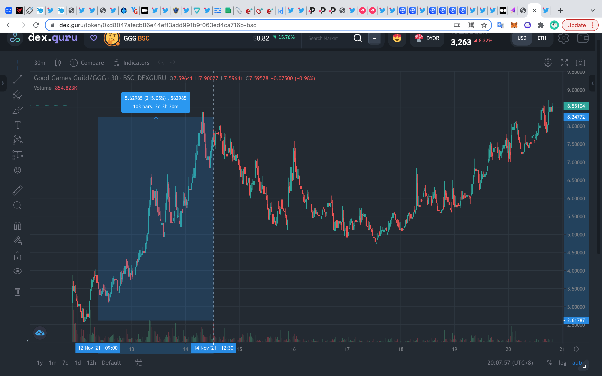
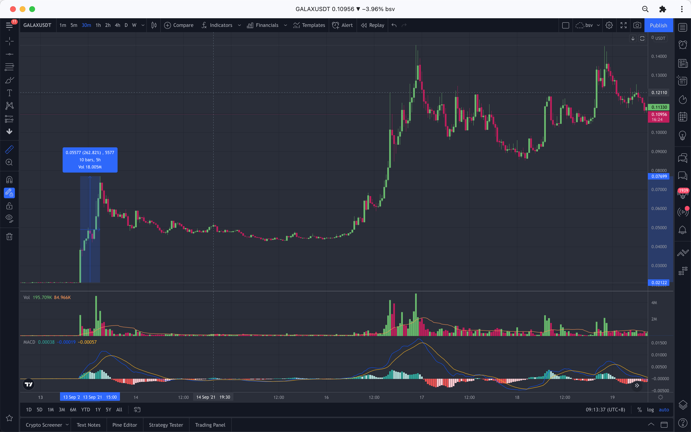
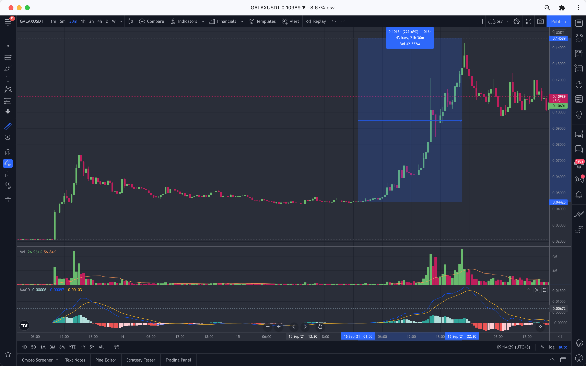
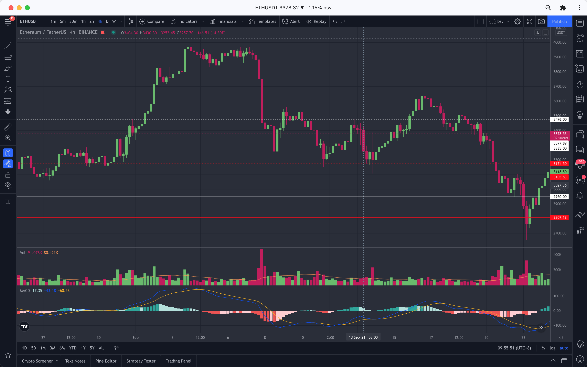
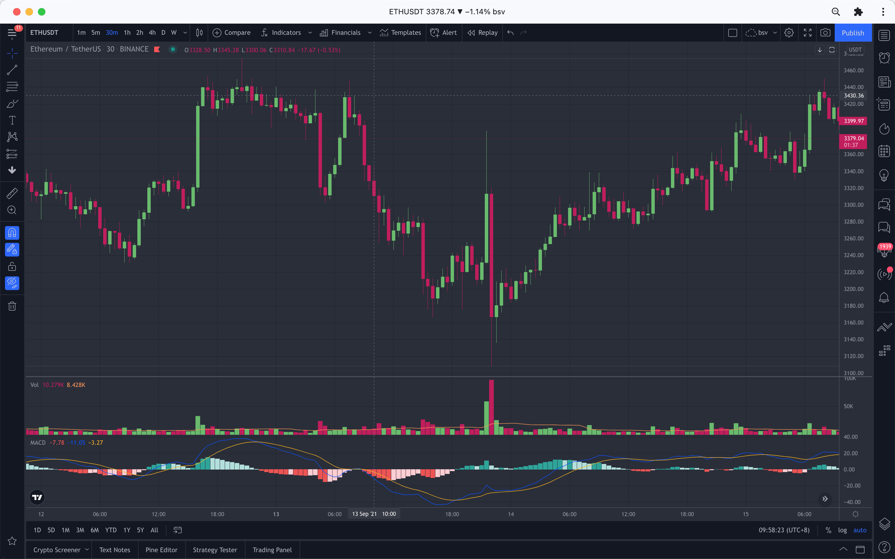

## 8次50%
333=13*(1+0.5)*(1+0.5)*(1+0.5)*(1+0.5)*(1+0.5)*(1+0.5)*(1+0.5)*(1+0.5)

## 抓住趋势的力量
- [2022年展望相关](https://three-recorder-52a.notion.site/39d5cccc77524d60bb2127bd5ace53a9?v=5b90c088d12b452f86eea95f4fe93b72)
- [a16z研究文章](https://future.a16z.com/)
- [animoca co-founder](https://ysiu.medium.com/)
- [coinbase 趋势研究 blog](https://blog.coinbase.com/aroundtheblock/home)
- [抓住趋势的力量](https://www.youtube.com/watch?v=meNKqChkGqU)

- [穿越周期的财富密码](https://www.youtube.com/watch?v=Cpdacjp72Ko)
- [【UP主的区块链知识传送门-哔哩哔哩】](https://b23.tv/D5kU8A)

## 新项目
- [空投项目精选](https://docs.google.com/spreadsheets/d/1Wdd1N_ilcIc9RFxRHrzdOZwqqamBE_NiLl4uoToUQZw/edit#gid=0)
- [投资机构的项目汇总](https://platinum-jasper-37b.notion.site/328b9017e1874f3da8750f2d1a4f12f1)
- [GameFi融资事件汇总](https://platinum-jasper-37b.notion.site/15e21a16a0a145f5a47bbe164d71998f?v=d77c75a671a44a699ae61dba4acd9b85)

## 投资机构portfolio

#### IDO launchpad

- [animocabrands](https://launchpad.animocabrands.com/)
- [PAID NETWORK](https://twitter.com/paid_network)
  - [website](https://ignition.paidnetwork.com/)
- [Polkastarter](https://twitter.com/polkastarter)
  - [website](https://polkastarter.com/)

- [Seedify](https://twitter.com/SeedifyFund)
  - [website](https://launchpad.seedify.fund/)
- [TrustPad](https://twitter.com/TrustPad)
  - [website](https://trustpad.io/)

- [enjinstarter](https://twitter.com/enjinstarter)
  - [website](https://launchpad.enjinstarter.com/)
- [polkafoundry](https://twitter.com/polkafoundry/)
  - [website](https://redkite.polkafoundry.com/#/)
- [Infinite Launch](https://twitter.com/InfiniteLaunch)     
  - [website](https://infinitelaunch.io/pools)
- [mantradao](https://app.mantradao.com/zendit)
- [DAO Maker](https://twitter.com/TheDaoMaker)
  - [website](https://daomaker.com/)
- [GameFi](https://twitter.com/GameFi_Official)
  - [website](https://gamefi.org/)

- [SolRazr](https://twitter.com/Solrazr_App)
  - [website](https://solrazr.com/)
- [YooShi](https://twitter.com/yooshi_official)
   - [website](https://yooshi.io/index)
- [BSCStation](https://twitter.com/bscstation)
   - [website](https://bscstation.finance/#/Dashboard)
- [Alpha Launchpad (Alpha Finance)](https://twitter.com/Alpha_Launchpad)
   - [website](https://alphafinance.io/)
- [MoonStarter](https://twitter.com/moonstarter_off)
   - [website](https://moonstarter.net/)
- [Dexlab](https://twitter.com/Dexlab_official)
  - [website](https://www.dexlab.space/)
- 
- 

#### animoca brands
- [官网](https://www.animocabrands.com/investment-portfolio)
- [block123]()

#### a16z
- [官网1_只有crypto](https://a16z.com/crypto/#vertical-landing-portfolio)
- [官网2_包含传统投资](https://a16z.com/portfolio/)
- [block123_1](https://www.block123.com/zh-hans/nav/008128550743.htm)
- [block123_2](https://www.block123.com/zh-hans/nav/721219866889.htm)

#### Coinbase Ventures
隶属于 Coinbase 的风险投资基金。
- [官网](https://ventures.coinbase.com/)
- [block123](https://www.block123.com/zh-hans/nav/635024800082.htm)

#### polychain.capital(a16z投资)
- [官网](https://jobs.polychain.capital/companies)
- [block123](https://www.block123.com/zh-hans/nav/922463639833.htm)

#### Pantera Capital
- [官网](https://panteracapital.com/portfolio/)
- [block123](https://www.block123.com/zh-hans/nav/138348409617.htm)

#### Binance Labs
- [官网](https://labs.binance.com/#)
- [block123](https://www.block123.com/zh-hans/nav/238852792801.htm)
#### kucoin Labs
- [官网](https://www.kucoin.com/zh-hans/land/kucoinlabs?spm=kcWeb.B1homepage.Header6.5)

### guilds

#### YGG
- [官网](https://yieldguild.games/)
#### GGG
- [官网](https://goodgamesguild.com/)
#### guildfi
- [官网](https://guildfi.com/)

## 10倍 投机方法论——参与，撸羊毛/ICO/IDO/IEO

#### 撸羊毛
- [【區塊先生】空投 - airdrop (354集)
](https://www.youtube.com/watch?v=N5C0pqcPYrA)
- [【GAMEFI】賺錢原理？時間點對了半年30倍！?６分鐘輕鬆入門](https://www.youtube.com/watch?v=n4J80-Rzms4)
- [空投热潮再起：羊毛党的狂欢，项目方的困境](https://www.chainnews.com/articles/017101221721.htm)
- [如何为下一轮空投做准备，获得4万块空投的心得！](https://www.youtube.com/watch?v=fqeY5JDwjU4)

#### ICO/IDO/IEO
- [平均收益30倍 币安IDO打新上手教程](https://www.youtube.com/watch?v=t5m9FHxykQQ) 
- [CoinList](https://blog.coinlist.co/introducing-the-coinlist-seed-fall-2021-batch/)
- [【TrustPad参与IDO-哔哩哔哩】](https://b23.tv/2fQLoL)
- [如何用pancake打新币 快速赚5-10倍](https://www.youtube.com/watch?v=IePR3HlUl5I&t=259s)
- [一级市场玩法-哔哩哔哩](https://b23.tv/830Xvd)
- [【用合约自动，抢Uniswap热门币-哔哩哔哩】](https://b23.tv/fNIl7W)
- [【Pancakeswap程序化交易-哔哩哔哩】](https://b23.tv/7ChKqg)
- 

## 30m/2h/4h——1/2倍 投机方法论

1. 币安宣布上线的
   1. 在Gate上存入资金
2. 币安launchpad
3. 知名投资机构（如a16z/coinbase/币安/...）投资的新项目
4. coinbase宣布上线的
5. 热度高的

### 过往案例分析

#### 1. quidd（polkastarter）
##### 为什么能*6？
1. animoca brands投资：不是骗子
2. 关注的人少：Twitter 只有2万关注，ido信息Twitter都不公布；
3. 上线涨的少，只有*3左右，IDO price：0.25，上线0.7～0.75，

#### 2. good games guild（paidnetwork）
##### 为什么能*3？
1. animoca brands投资：不是骗子
2. 关注的人不多：IDO只在paidnetwork
3. IDO price：0.3，上线2.5左右，但是，前面有YGG 80多亿估值。

#### 3. Gala

#### 币安宣布上市

2021-09-13 10:00——[币安宣布上市Gala](https://www.binance.com/zh-CN/support/announcement/e01f0f9ff68c4150b7fb6ee2fcd5159b)

#### 媒体的反应

2021/09/14 16:04——[金色财经——觅新 | Gala：构建区块链游戏生态系统和NFT平台](https://www.jinse.com/blockchain/1158953.html)

#### 币价走势

- 第一波：在gate/kucoin

注意放量信号

**260%**  62个5m 5h10m 2021-09-13 10:00～15:00 

- 第二波

注意放量信号

**229%**  43个30m  21.5小时  2021-09-16 1:00～22:30 

- ETH的走势

**26% 4小时 下跌中枢的第三次向下试探**

**30m 向上盘整转折中**

**敢进去吗？！！！**

#### 2. Gala

#### 3. Gala

#### 4. Gala

#### 5. Gala

#### 6. Gala

## 半年——10/15倍 投机方法论

### The Sandbox

